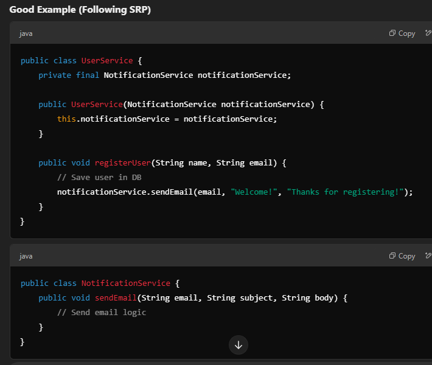
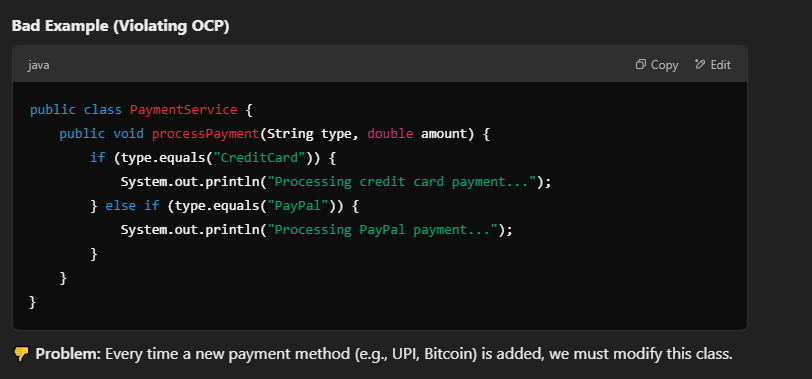
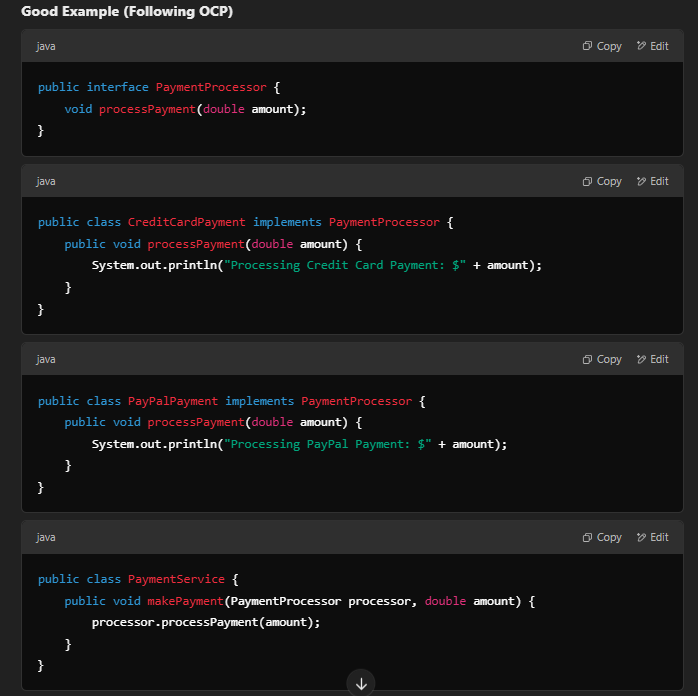
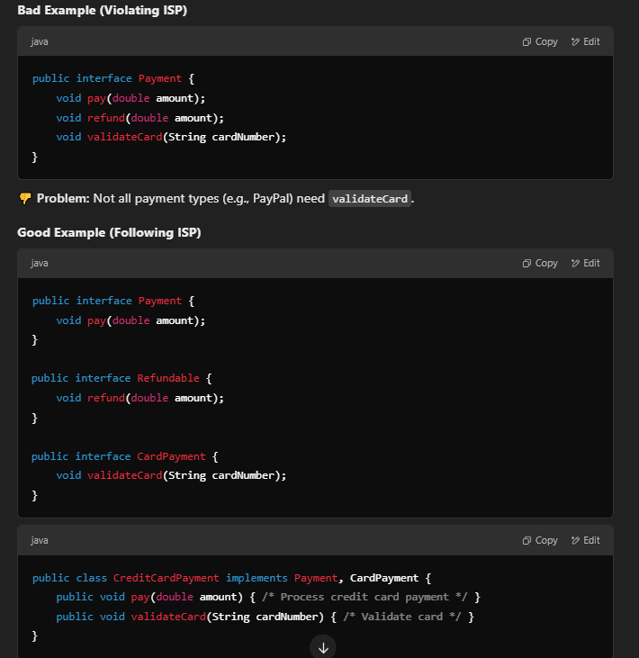
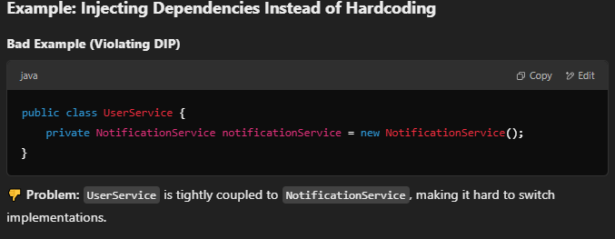
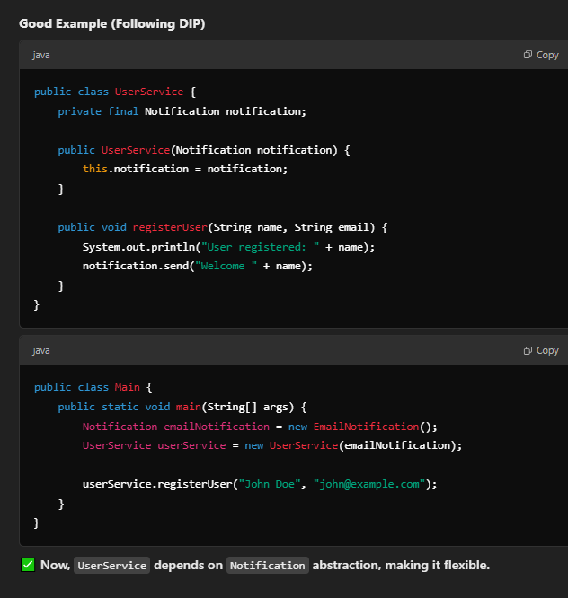

# Interview Questions - Design Patterns & SOLID Principles

## 1. SOLID Principles

### Single Responsibility Principle (SRP)

Every Java class must perform a single functionality.

**Example:** Instead of one `UserService` handling both `registerUser()` and `notifyCreation()`, we break it into separate classes.



> ✅ Now, `UserService` only registers users, and `NotificationService` handles emails.

---

### Open-Closed Principle (OCP)

A module should be **open for extension** but **closed for modification**.





---

### Liskov Substitution Principle (LSP)

Derived/child classes must be completely substitutable for their base classes. Subclasses should be replaceable without altering the behavior of the program.

---

### Interface Segregation Principle (ISP)

Larger interfaces should be split into smaller ones. Do not force any client to implement an interface which is irrelevant to them. **Clients should not be forced to depend on methods they do not use.**



---

### Dependency Inversion Principle (DIP)

Use abstractions to decouple high-level modules from low-level modules. **High-level modules should not depend on low-level modules.** (Do not depend on concrete implementation; rather, depend on abstraction.)





---

## 2. Design Patterns

### Creational: Singleton Pattern

A Singleton is a design pattern that **ensures only one instance of a class exists throughout the application** and **provides a global access point to it**.

#### Key Features

- **Single Instance** – Only one object is created and shared.
- **Private Constructor** – Prevents direct instantiation from outside (private constructor).
- **Global Access Point** – Provides access via a static method.

#### When to Use Singleton?

- Database connections
- Logging framework
- Configuration settings

```java
class Singleton {
    private static Singleton instance;

    private Singleton() {}

    public static Singleton getInstance() {
        if (instance == null) { // First check
            instance = new Singleton();
        }
        return instance;
    }
}
```

---

### Structural Design Patterns

Structural design patterns focus on how classes and objects are arranged to create larger, more complex structures in software development.

#### Decorator Method Design Pattern

It allows us to dynamically add functionality and behavior to an object without affecting the behavior of other existing objects within the same class. We use inheritance to extend the behavior of the class. This takes place at compile-time, and all the instances of that class get the extended behavior.

---

### Behavioral Design Patterns

Group of design patterns that focus on how objects and classes interact and communicate in software development.

#### Chain of Responsibility Method Design Pattern

Chain of responsibility pattern is used to achieve loose coupling in software design where a request from the client is passed to a chain of objects to process them. Later, the object in the chain will decide themselves who will be processing the request and whether the request is required to be sent to the next object in the chain or not.

#### Observer Method Design Pattern

It establishes a one-to-many dependency between objects, meaning that all of the dependents (observers) of the subject are immediately updated and notified when the subject changes.

